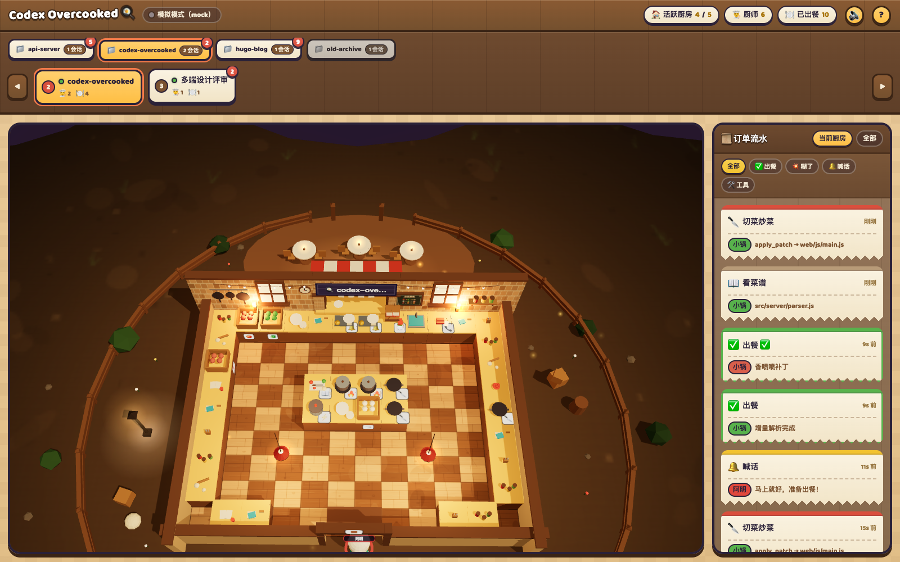

# Order Up! 🍳

> 把你的 AI 编程 agent 会话，实时变成一场「胡闹厨房」。
> Turn your AI coding agent sessions into a real-time Overcooked-style kitchen.



**Order Up!** 是一个纯本地的可视化玩具：它盯着本机的 agent 会话记录，把每一次工具调用实时演成一间 3D 卡通厨房里的忙活——每个会话是一间厨房，每个 agent / 子 agent 是一位 Q 版厨师。读文件就去案板看菜谱，改代码就去炒锅切菜，跑命令就上灶台开火，任务完成就出餐：**Order up!** ✅

- 🎮 **3D 卡通厨房**：参考 Overcooked 实机画面还原，Three.js 本地内置，无任何 CDN
- 🪟 **开放式传菜窗**：出餐口是贯通厨房与餐厅的出餐吧台（红白雨棚 + 招牌 + 暖灯串），客人就围坐在吧台前等菜，没有高墙阻隔
- 🍽 **服务员上菜**：红头巾小二从吧台取餐、头顶菜盘小碎步送到客人桌上；客人低头扒饭 8–15 秒、中途弹「好吃！」，吃完才起身走入夜色，翻台迎新
- 🥘 **菜品池**：24 道中式菜（番茄炒蛋、青椒炒豆干、红烧肉、清蒸鲈鱼……）按任务哈希确定性出菜——同一任务同一道菜；盘中餐按形状×配色程序化拼装，飞菜、吧台、桌上全链路外观一致
- 🧑‍🍳 **厨师有名有姓有样子**：128 个预定义厨师名按 threadId 哈希分配（冲突顺延）；制服/帽型/体型/肤色按 id 确定性派生，主厨戴加高金带大厨帽
- 🔄 **360° 自由环绕**：鼠标拖拽任意角度环绕厨房（俯仰 30°–80°、滚轮缩放），挡视线的墙会自动淡出
- 🔔 **票卡式轻提示**：出餐 ✅、糊了 💥、断线重连 📡 底部弹 toast
- 🔊 **合成音效**：纯 WebAudio 振荡器/噪声合成，切菜哒哒、炒菜嘶嘶、出餐叮叮、糊了闷响，顶栏 🔊 一键静音
- 🧭 **新手友好**：首次打开弹出引导浮层；没有厨房时显示游戏风「生火备菜」进度条空态；顶栏 `?` 随时重看说明
- 📦 **零外部依赖**：纯 Node.js 实现，无需构建，一行命令开火
- 🔒 **纯本地**：只读取会话文件，绝不写入；服务器只监听 localhost
- ✅ **自带自测**：`npm test` 44 项断言（回放 / 懒加载 / SSE / demo / 健壮性），前端另有切换系统脚本化自测
- 🗺️ **路线图**：当前支持 Codex CLI，计划适配 Claude Code 与 Kimi CLI——所有 AI 厨师在同一间厨房出餐

## 玩法说明：事件 → 厨师动作

| agent 事件 | 厨师动作 | 工位 |
|---|---|---|
| 读文件 / `cat`、`rg`、`ls` 等只读命令 | 看菜谱 📖 | 案板 |
| `view_image` 查看图片 | 看图片 📖 | 案板 |
| `apply_patch` / 编辑文件成功 | 切菜炒菜 🔪 | 炒锅 |
| 补丁应用失败 | 糊了 💥（烟雾特效 + toast） | 原地 |
| `exec_command` / shell 命令 | 开火上灶 🔥 | 灶台 |
| `write_stdin` 查看终端输出 | 盯灶台 👀 | 灶台 |
| `write_stdin` 向终端输入内容 | 喂柴火 🪵 | 灶台 |
| `web_search` | 打电话订食材 📞 | 电话台 |
| MCP / 自定义工具调用 | 高压锅 ⚡ | 特殊厨具 |
| `imagegen` / 生成图片 | 画招牌 🎨 | 特殊厨具 |
| `agent_reasoning` / `update_plan` / 目标管理 | 想菜单 💭 | 菜单角（翻阅菜单） |
| `context_compacted` 上下文压缩 | 收拾台面 🧹 | 原地 |
| `thread_rolled_back` 会话回滚 | 复盘 🔙 | 原地 |
| `agent_message` / `user_message` | 喊话 / 顾客点单 🔔 | 出餐口 |
| 协作工具（`send_message` / `wait_agent` / `followup_task` 等） | 给队友传话 / 给队友派活 / 叫停队友 / 等队友 💬 | 走到目标队友厨师身旁，面对面交谈/等待 |
| `task_complete` | 出餐 ✅（计数 +1，toast + 音效；菜品池按任务挑一道菜） | 出餐口 → 吧台 → 服务员 → 客人餐桌 |
| `turn_aborted` / 子 agent 被叫停（`interrupted`） | 糊了 💥（烟雾特效 + toast） | 原地 |
| `spawn_agent` / 子 agent 开工 / 新会话 | 派出小厨师 / 新厨师入职 👨‍🍳 | 从门口走进来 |
| 5 秒无新事件 | 原地歇脚 ☕（喝水 / 擦汗 / 东张西望） | 原地 |
| 歇脚约 18 秒仍无新事件 | 走回休息区打瞌睡 💤 | 休息区 |
| 打瞌睡约 60 秒仍无新事件 | 起身走出门下班 👋（来新事件重新入职） | 门口 |

## 厨房里的生活气息

- **出餐进餐厅**：出餐口是开放式传菜窗 + 贯通出餐吧台（红白雨棚、🍽 招牌、暖灯串）。菜先从厨师处抛物线飞上吧台、弹菜名；吧台外就是餐厅小院（3 桌 5 座烛光餐桌），**服务员**取餐后头顶菜盘绕到客人桌边上菜；客人低头扒饭 8–15 秒、用餐中途弹「好吃！」，吃完起身走入夜色，翻台迎新。歇业时餐厅同步压暗、服务员停止接单。
- **菜品池**：24 道中式菜按任务哈希确定性出菜（同一任务同一道菜，不同任务均匀分布）；盘中餐按 6 种形状（块状/条状/叶菜/整鱼/饭山/汤面）× 主配色程序化拼装——番茄炒蛋是红块配黄块，清蒸鲈鱼是银身配葱丝，一眼可辨。
- **协作有来有回**：派活/传话的厨师会走到队友身旁，对方暂停手中活、转身倾听，双方气泡交替、点头回应；在睡觉的先被叫醒，谈完回去接着干；等队友不打扰对方干活，对方偶尔回头招手。
- **厨师众生相**：厨师名从 128 个预定义名字里按 threadId 哈希分配（同厨房冲突顺延），不再是任务标题或 id 前缀；制服 8 色、帽型 4 种、围巾、高矮胖瘦、肤色都按 id 确定性派生——同一位厨师每次入职长一个样。
- **黄昏氛围**：厨房外是暮色小院——环形木栅栏与门柱、石板小径、路灯、花丛灌木、远山小屋剪影与炊烟、萤火虫；外圈晕环压暗把视线锁在厨房，歇业时整体压暗。

## 厨房切换与 3D 视角

- **两级切换条**：第一级是「项目标签」（同 cwd 的会话归为一个项目，按最近活跃倒序）；第二级是当前项目的会话厨房卡片（lastTs 倒序），一次只展示一间全屏 3D 厨房
- **任意切换**：点击项目标签切换项目 / 点击会话卡片切换厨房 / `←` `→` 键前后切换 / 数字键 `1-9` 直达（键盘按全局展示顺序，可跨项目，标签自动跟随）/ 切换条两侧 ◀ ▶ 按钮
- **多会话伸缩**：一个项目的会话再多，卡片条也只铺当前项目并横向滚动，当前会话卡片始终保持在可视区内；只有一个项目时标签排自动隐藏
- **未读红点**：其他厨房的未读事件在卡片上累计红点，项目标签上再聚合一枚；切换完全手动，不会自动跳转
- **占位厨房**：启动懒加载未回放完整历史的旧会话显示为占位卡片（斜体名 + 「未加载」角标），点击后按需加载完整历史，厨师随即入场
- **3D 视角**：鼠标拖拽 **360° 自由环绕**（俯仰 30°–80°），滚轮缩放；挡视线的墙按方位角自动淡出，转回淡入；默认正北 60° 俯角、顶部预留 HUD，餐厅区自然入画
- **歇业置灰**：10 分钟无新写入的厨房自动歇业，切换条卡片压暗并挂「歇业中」木牌
- **断线横幅**：SSE 连接断开时舞台顶部挂出「📡 连接断开，正在自动重连…」横幅，重连成功自动消失并弹 toast
- 顶部全局统计（活跃厨房 / 厨师数 / 已出餐）、厨师超过 12 人时显示「后厨 +N」木牌

## 订单流水

右侧「订单流水」是 Overcooked 订单票样式（撕纸锯齿边 + 彩色时间条），点「📜 订单流水」按钮展开/收起：

- **厨房过滤**：「当前厨房 / 全部」切换，全部模式下每张票标注来源厨房名
- **类型过滤 chips**：全部 / ✅ 出餐 / 💥 糊了 / 🔔 喊话 / 🛠 工具，一键只看某类事件
- **出餐票**：显示「菜名 · 任务摘要」（如 `酸辣土豆丝 · 修复断线重连`）
- **相对时间**：「刚刚 / 12s 前 / 3m 前」每 5 秒自动刷新，悬停可看绝对时间
- **长详情展开**：过长的命令/路径默认截断，点击可展开 / 收起

## 音效与引导

- **音效**：纯 WebAudio 合成（零音频资源文件），切菜哒哒、炒菜嘶嘶、出餐叮叮、糊了闷响、新厨师号角、电话铃各有音色；同类音效有节流，密集事件不会糊成一坨。顶栏 🔊 按钮一键静音/恢复。
- **自动播放策略**：遵守浏览器规范，首次点击 / 按键（任意用户手势）之后才发声，之前静默不报错。
- **轻提示**：出餐 ✅、糊了 💥、断线重连 📡 时底部弹出票卡式 toast（3 秒自动退场，最多叠 4 条）。
- **首次引导浮层**：第一次打开自动弹出玩法说明（厨师动作对照表 + 快捷键），点「开始围观 🍽」或 `Esc` 关闭并记忆（localStorage）；之后随时点顶栏 `?` 按钮或按 `?` 键重看。
- **空态进度条**：还没有任何厨房时，舞台中央显示游戏风进度条（木框 + 金橙填充 + 🔥 火苗循环扫过）和「正在生火备菜…」，下方给出启动 codex 会话与演示模式两种入口。

## 快速开始

要求 Node.js ≥ 18。

### 方式一：本地直接跑（现在就能用）

```sh
git clone <this-repo>
cd Order-Up
node bin/codex-kitchen.js
```

### 方式二：npm link 后全局使用

```sh
npm link
codex-kitchen
```

### 方式三：一键安装脚本

```sh
curl -fsSL <your-repo-url>/install.sh | sh
```

> 使用前请把 `<your-repo-url>` 替换为实际 git 仓库地址（或先设置环境变量 `CODEX_KITCHEN_REPO`）。
> 脚本会把仓库克隆到 `~/.codex-kitchen` 并执行 `npm link`，之后可直接使用 `codex-kitchen` 命令。

### 方式四：npx（发布后）

```sh
npx codex-kitchen
```

> ⚠️ 这是发布后的目标用法，需要先把包 `npm publish` 到 npm registry。当前包尚未发布，请先用上面的本地方式。

### 方式五：一键重启脚本（清理旧实例）

```sh
./start.sh --demo        # 杀掉所有正在运行的 codex-kitchen 进程，再重新启动
npm run restart -- --port 4900   # 等价 npm 入口，参数原样透传
```

启动后自动打开浏览器（默认 http://localhost:4848/），然后你用 agent 干活，厨房里就有厨师开始跑堂了。

## CLI 参数

| 参数 | 说明 | 默认值 |
|---|---|---|
| `--port <n>` | 监听端口；被占用时自动自增（最多试 50 个） | `4848` |
| `--demo` | 演示模式：内置模拟器产出 3 间厨房的事件流，无需真实会话 | 关 |
| `--no-open` | 启动后不自动打开浏览器 | 关（自动打开） |
| `--sessions-dir <path>` | agent 会话目录 | `~/.codex/sessions` |
| `--replay-sessions <n>` | 启动回放最近 n 个会话文件；其余旧会话作占位厨房，点击切换后按需加载 | `5` |
| `--replay-lines <n>` | 每个会话只回放尾部 n 行（首行 `session_meta` 必回放，保证厨房/厨师不缺席） | `100` |
| `-h, --help` | 显示帮助 | — |

## 数据源说明

- 只读取 `~/.codex/sessions/**/*.jsonl`（Codex CLI 的会话记录），**绝不写入、修改或删除**任何会话文件。
- 启动懒加载：只回放最近 5 个（`--replay-sessions`）会话文件，且每个文件只回放「首行 + 尾部 100 行（`--replay-lines`）」——尾部偏移从后往前读块定位，大文件不整读；其余旧会话只读首行建「占位厨房」（有名字/项目信息、无厨师、卡片带「未加载」角标），点击切换后通过 `GET /api/kitchen/<id>/history` 按需完整回放（幂等，结果同时 SSE 广播给其他页面）。占位文件之后有新写入会自动完整加载，新出现的会话文件仍从头实时 tail。
- 厨房归并规则：同一根线程（含子 agent 线程）归为一间厨房；无父子信息时按 `cwd` 归并。厨房名优先取会话标题，拿不到再取 `cwd` 的目录名，重名时自动追加 `#短id` 消歧。
- 出餐菜名：从最后一条 agent 消息提取任务摘要（剥离 markdown、跳过 JSON/围栏），再按「摘要 + 厨房 id」哈希从 24 道菜品池确定性挑菜——`dish.name` 是菜名、`dish.task` 保留任务摘要。

## 演示模式

没有 agent 会话也能看效果，两种玩法：

- `--demo`：后端模拟器驱动，走完整 SSE 链路（用于验收真实数据通路）；
- `http://localhost:4848/?mock=1`：纯前端内置模拟数据，后端随便什么模式都行（用于前端独立开发）。

## 自测

- **服务端自测**：`npm test` 跑 `scripts/selftest-server.js`——造 fixture 会话（含坏行 / 半截行 / 全事件类型 / 父子线程 / 懒加载会话组），断言回放快照、回放数量与行数上限、占位厨房按需加载接口（含幂等）、SSE 实时流、demo 模式与畸形输入健壮性、菜品池出餐契约，共 44 项断言。
- **前端自测**：`http://localhost:4848/?mock=1&selftest=1` 脚本化断言项目标签分组排序、标签/卡片/键盘切换、无自动跟随、未读红点聚合、多会话横向滚动伸缩、占位厨房懒加载（点击加载完整历史）、订单票渲染与过滤、渲染器降级、控制台零报错，结果写入页面 `#selftest-result`（供无头浏览器校验）。
- **3D 场景自测/截图**：`node scripts/devtool-server.mjs [port]` 静态托管 `web/` 后用浏览器或无头 Chrome 打开 `/js3d/test.html`——带时间轴的自测场景（6 厨师 + 全部动作 + 服务员上菜）。

## 路线图

- [x] Codex CLI 数据源（`~/.codex/sessions`）
- [x] 自测脚本（`npm test` 服务端 44 项断言 + 前端切换系统自测）
- [ ] Claude Code 数据源适配
- [ ] Kimi CLI 数据源适配
- [ ] 多数据源同屏：所有 AI 厨师在同一间厨房出餐
- [ ] npm 发布（`npx` 一键开火）

## 隐私说明

纯本地应用：数据不离开你的机器。服务器只监听 localhost，不联网、不上报、不收集任何信息；会话内容仅在内存中解析后通过本地页面展示。

## 项目结构

```
├── bin/codex-kitchen.js   # CLI 入口
├── start.sh               # 一键重启：清理旧实例端口后再启动（npm run restart）
├── server/                # 纯 Node 后端（静态托管 + SSE + JSONL 解析/监听 + demo 模拟器）
│   ├── index.js  parser.js  watcher.js  demo.js  chef-names.js（128 厨师名池 + 哈希分配）
├── web/                   # 游戏前端（无构建、无外部 CDN）
│   ├── index.html  css/style.css
│   ├── vendor/three.module.min.js   # Three.js r160 本地内置
│   ├── js3d/   kitchen3d / stations / chef / decor / backdrop / dining / fx / audio
│   │           / palette / textures / dishes（24 道菜品池 + 视觉元数据，服务端共用）
│   └── js/     store / net / mock / kitchens-ui / main / selftest / renderer-stub
│               （数据层 + 切换系统 + 前端自测 + 降级渲染器）
├── scripts/               # selftest-server.js（npm test，44 项断言）/ devtool-server.mjs（3D 自测截图）
├── docs/                  # art-direction.md 美术调研 / scoring.md 评分标准 / inter 指令协作记录
├── screenshots/           # 实机截图（含 verify* 验证截图）
└── references/            # Overcooked 官方截图参考
```

## License

MIT
