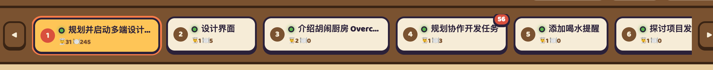
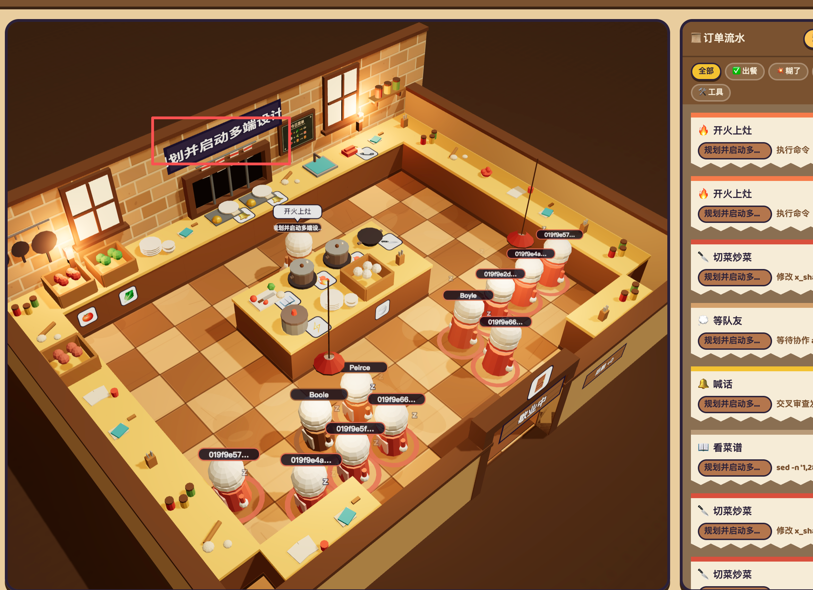
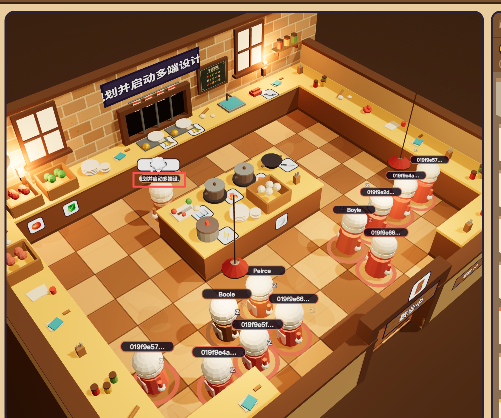
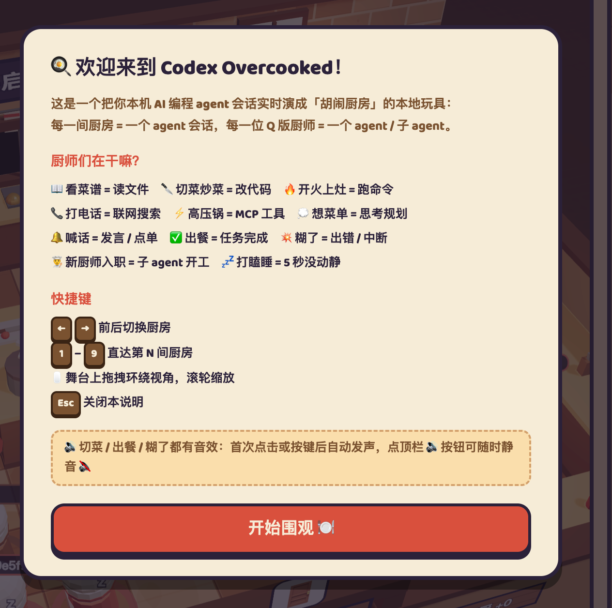
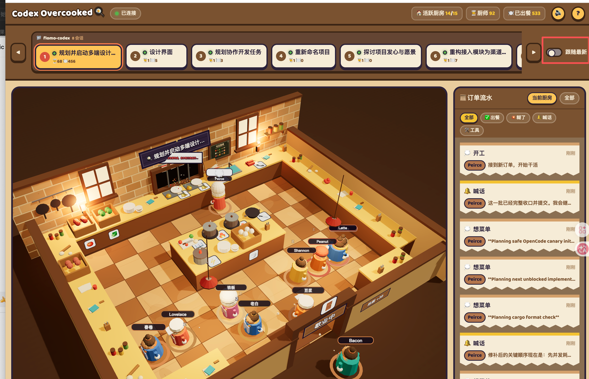

## 2026.07.27

- 11:27 给队友派活应该是跟另外一个厨师交谈
- 11:31 codex 中有项目-会话的概念, 这里也应该体现

- 11:32 这个板子上的文字效果应该优化 

- 11:39 厨房里不应该有那么多在休息的 agent 厨师
- 11:41 主厨的名字不应该是任务的名字

- 11:46 想菜单 -> 应该有对应的区域专门去翻阅菜单

- 11:47 厨师的名字不应该是一长串字符串, 而是通过 hash 的方式, 映射到指定的厨师名字上(冲突则下一个), 预先定义好 128 个厨师名
- 11:48 不同的厨师应该有不同的形象
- 12:47 去掉跟随最新, 通过项目标签的方式切换不同项目, 注意项目下的任务比较多

- 12:48 歇业中的门为什么一直在闪烁, 修复

- 12:49 优化厨房外的背景
- 

